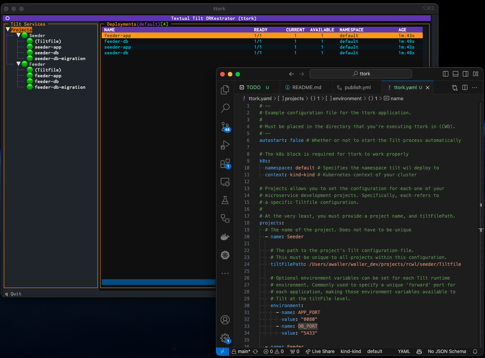
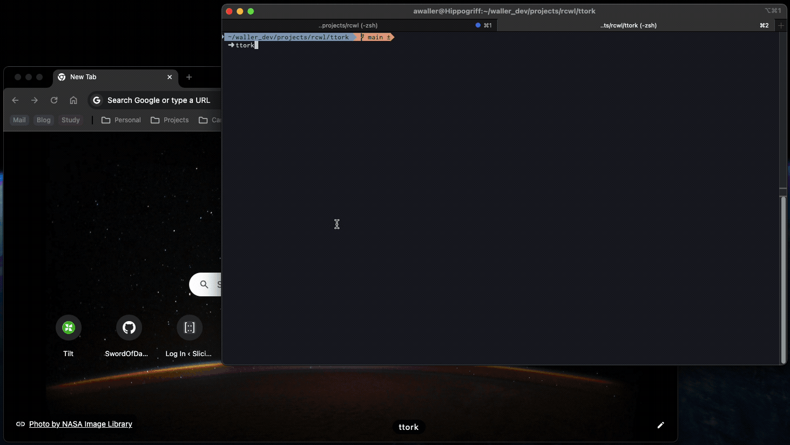
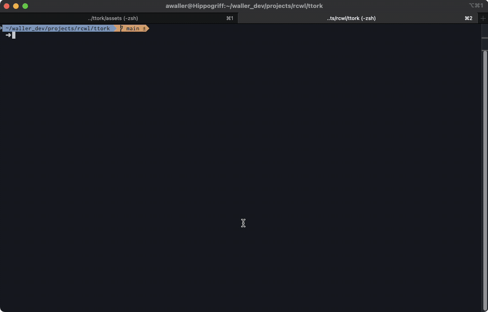
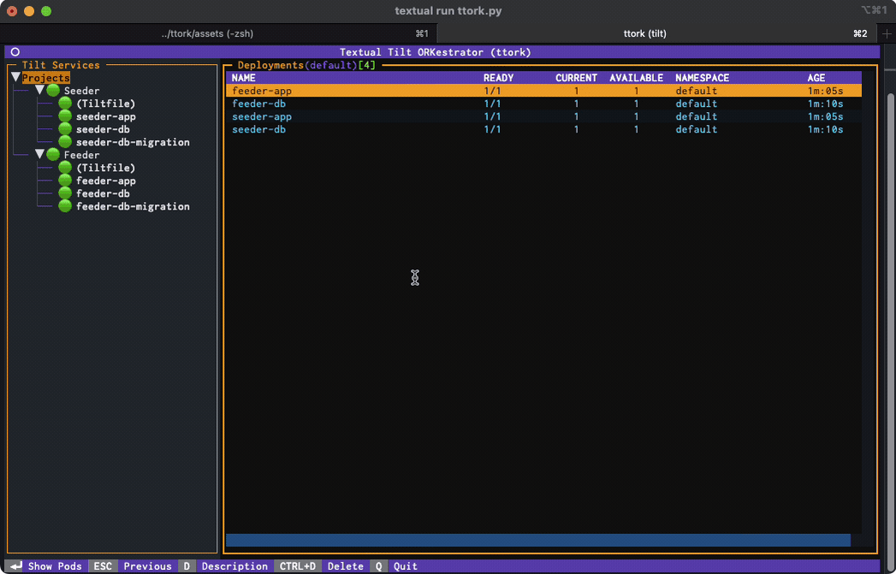
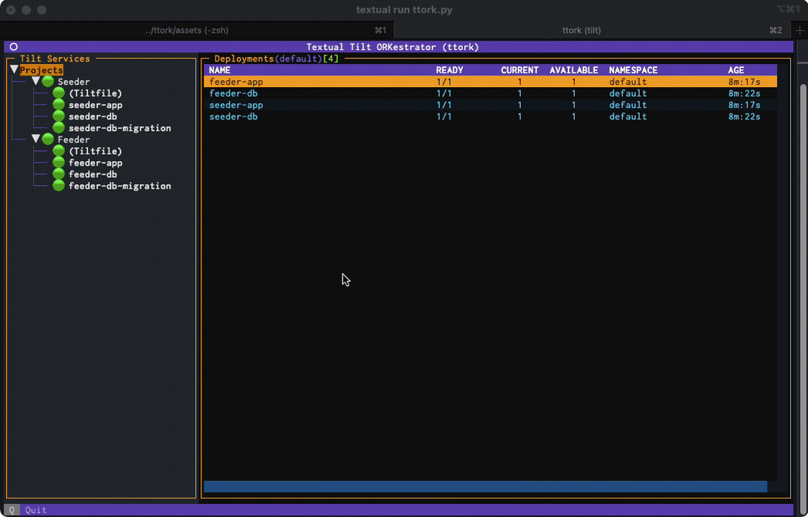
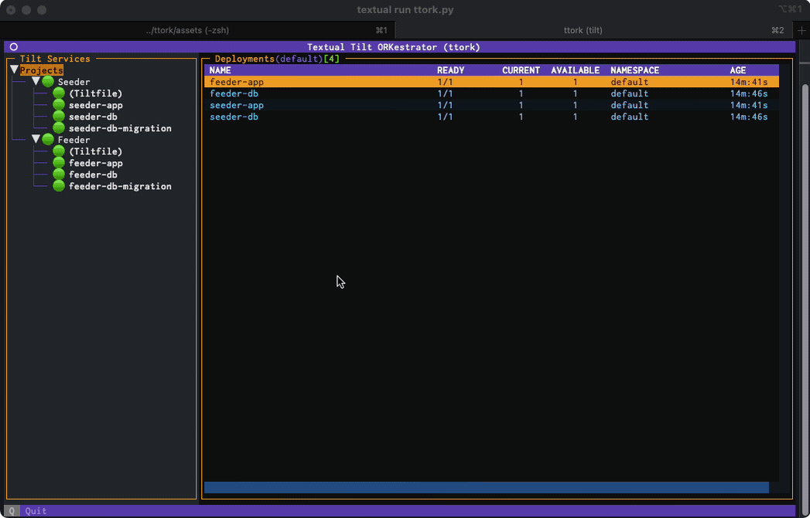
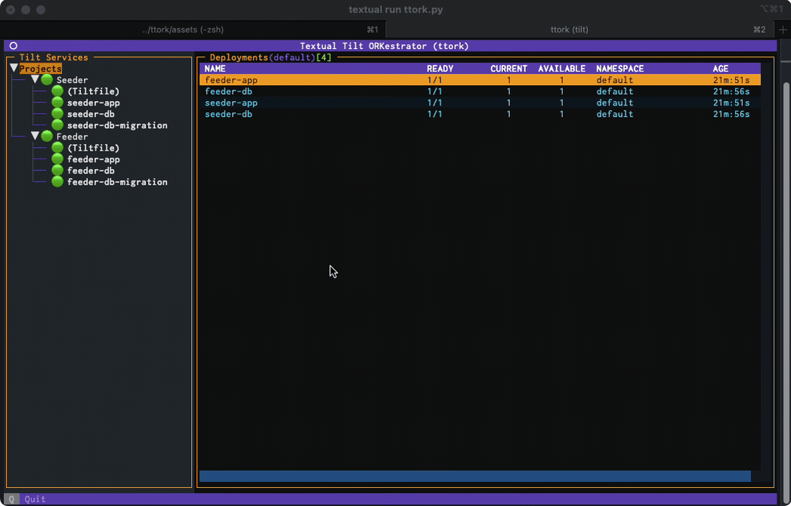

[](http://todogetlink)
[](https://github.com/SwordOfDamocles/ttork/releases)
[](https://pypi.org/project/ttork/)
[](https://pypi.org/project/ttork/)
---


## Textual Tilt Orkestrator (ttork): Multiple-Repository Tilt Orchestration Tool

Ttork is a rich terminal application for managing multiple instances of the
wonderful Tilt ([tilt.dev](https://tilt.dev)) microservice development tool.
It's designed for complex environments that separate their microservices into
individual repositories. Ttork makes it easy for each repository to manage
and maintain its own individual Tiltfile development configuration, while
providing a way for the developer to bring up the services of several
repositories in a single command.



## View Kubernetes Resources While Developing!

Beyond Tilt bringup, ttork also provides a rich kubernetes management interface
for simple viewing and management of generated kubernetes resources within
the developers local cluster. It's NOT meant to be a kubernetes management
tool, but does provide a simple way for the developer to view resources and
**shell into running containers** without having to remember complex kubectl
commands.




## Note...

**The ttork project was created initially for my own use, as a development tool
and as a visual aid for writing some articles I have planned. I've made it
freely available, and will do my best to continue to support and maintain,
but resources are currently pretty limited.**

---


## Screenshots

1. **Tilt Bringup - Initial Start**
    

2. **Easily Shell Into Running Container**
    

3. **Inspect Deployments**
    

4. **Inspect Pods**
    

5. **Container Status and Logs**
    

6. **Tilt Teardown - Clean up all Resources**
    


# Installation
While you're welcome to clone the repository and run it from there, there are
two other installation methods which are currently supported.

**Note**: All current testing has been done on latest MacOS. Installing on
anything else falls into the `choose your own adventure` category.

## Python - pip
ttork can be installed into your current python environment by simply using pip:
```bash
pip install ttork
```

## Homebrew - MacOS
ttork can also be installed via Homebrew if you're on MacOS.

First, tap the repository:
```bash
brew tap SwordOfDamocles/ttork
```

Then install:
```bash
brew install swordofdamocles/ttork/ttork
```

Check installed version:
```bash
$ ttork version
ttork, version 0.3.1
```
